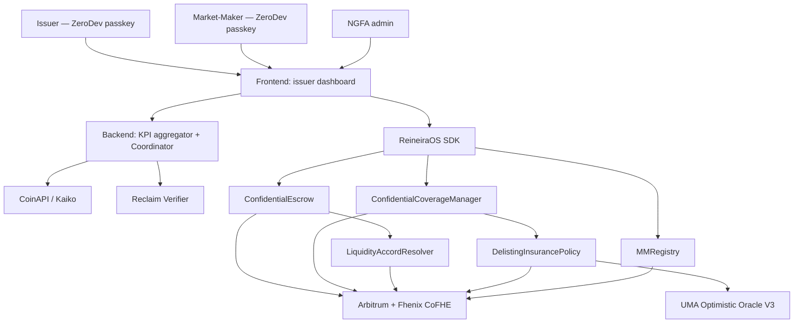

# Architecture — Liquidity Accord

## Ecosystem

| Repo                         | Stack                                                 | Purpose                                                                 |
| ---------------------------- | ----------------------------------------------------- | ----------------------------------------------------------------------- |
| **liquidity-accord** (here)  | pnpm monorepo (backend + app)                         | Issuer / MM / NGFA-admin application                                    |
| **reineira-atlas**           | Markdown + Claude agents                              | Startup OS for Liquidity Accord                                         |
| **reineira-code**            | Hardhat + Solidity + cofhejs                          | Custom resolver (`LiquidityAccordResolver`), policy (`DelistingInsurancePolicy`), registry (`MMRegistry`) |
| **platform-modules**         | upstream template                                     | Pulls — backend starter, app starter                                    |

## Tech Stack

| Layer            | Technology                                                          | Purpose                                                   |
| ---------------- | ------------------------------------------------------------------- | --------------------------------------------------------- |
| Contracts        | Solidity ^0.8.24 + Hardhat + cofhejs                                | Resolver, policy, registry                                |
| Frontend         | React 19 + TypeScript + Vite + Zustand + TanStack Router + Tailwind | Issuer / MM / admin dashboards                            |
| Backend          | TypeScript + Clean Architecture (Vercel-ready, DB-agnostic)         | KPI aggregator, Coordinator interface, exchange adapters  |
| Wallet (humans)  | ZeroDev — ERC-4337 smart accounts + passkeys                        | Issuer + MM counterparties                                |
| Wallet (treasuries) | Safe multisig                                                    | Issuer token treasuries                                   |
| Encryption       | Fhenix CoFHE                                                        | Retainer amounts, premiums, risk scores                   |
| Settlement       | Stablecoin-agnostic via `IFHERC20`                                  | USDC primary, EURC for EU                                 |
| Cross-venue      | Circle CCTP v2                                                      | Multi-exchange USDC moves                                 |
| Verification     | Reclaim zkTLS (exchange APIs), Chainlink (prices), UMA OOv3 (dispute) | KPI attestation + dispute resolution                    |
| Deploy           | Hardhat (contracts), Vercel (apps)                                  | Infrastructure                                            |

## System Diagram



## Data Entities (backend custom — on top of platform-modules escrow/withdrawal/profile)

| Entity      | Plaintext / Encrypted                 | Key Fields                                                                         |
| ----------- | ------------------------------------- | ---------------------------------------------------------------------------------- |
| Engagement  | Plaintext                             | id, issuer, mm, venue, pairSymbol, kpiConfigHash, startDate, endDate, status       |
| Attestation | Plaintext (refers to encrypted data)  | id, engagementId, windowStart, windowEnd, kpiSnapshotHash, coordinatorSigs, score  |
| MMProfile   | Plaintext                             | id, operatorAddress, name, tier, certifiedSince, certificationExpiry, pairs, kpis  |
| Escrow      | Encrypted amount (FHE)                | Inherited from platform-modules; refers to engagementId                            |
| Coverage    | Encrypted (premium, risk, dispute)    | Inherited from platform-modules; refers to engagementId + venue                    |

## Running Locally

```bash
# Install
pnpm install

# Backend
pnpm dev:backend

# Frontend
pnpm dev:app               # :4831

# Contracts (from sibling repo)
cd ../reineira-code && npm install --legacy-peer-deps && npx hardhat test
```

## Directory Layout

```
packages/
  backend/
    api/v1/
      engagements/         # POST / GET engagements
      attestations/        # POST / GET attestations
      mm-profiles/         # POST / GET MM profiles
      escrows/             # (from platform-modules, keep)
      ...
    src/
      domain/
        engagement/
        attestation/
        mm-profile/
        escrow/            # (from platform-modules)
        ...
      application/
        dto/engagement/
        dto/attestation/
        dto/mm-profile/
        use-case/engagement/
        use-case/attestation/
        use-case/mm-profile/
      infrastructure/
        repository/memory/
          memory-engagement.repository.ts
          memory-attestation.repository.ts
          memory-mm-profile.repository.ts
  app/
    src/
      components/features/
        engagement-list.tsx, engagement-form.tsx
        attestation-list.tsx, attestation-form.tsx
        mm-profile-list.tsx, mm-profile-form.tsx
      stores/
        engagement-store.ts
        attestation-store.ts
        mm-profile-store.ts
      services/
        EngagementService.ts
        AttestationService.ts
        MMProfileService.ts
      routes/_authenticated/
        engagements.tsx
        attestations.tsx
        mm-profiles.tsx
        dashboard.tsx
```
